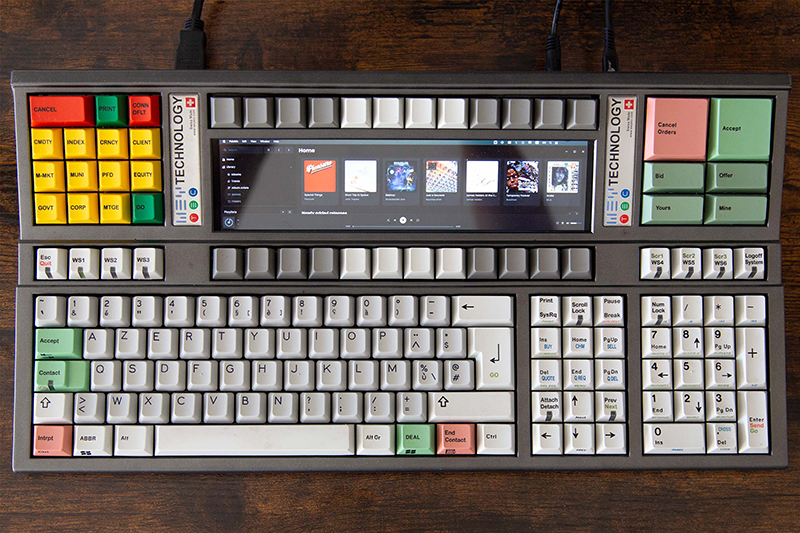
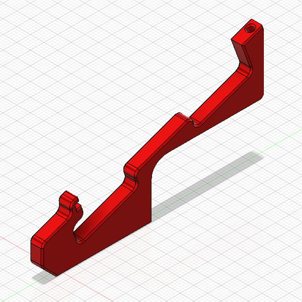
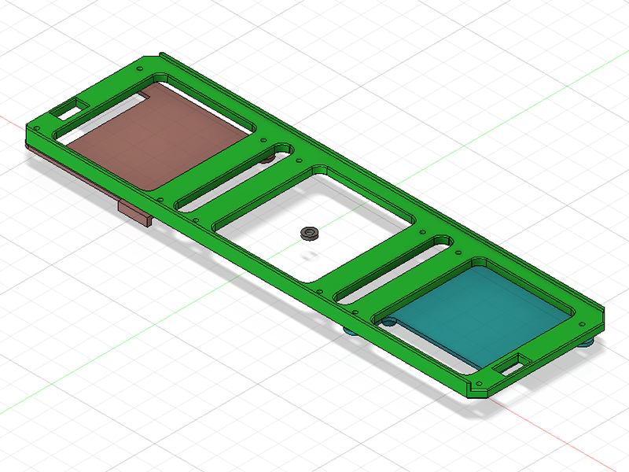
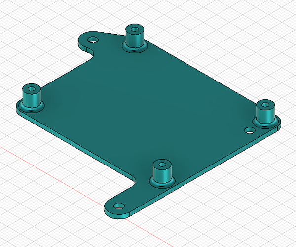
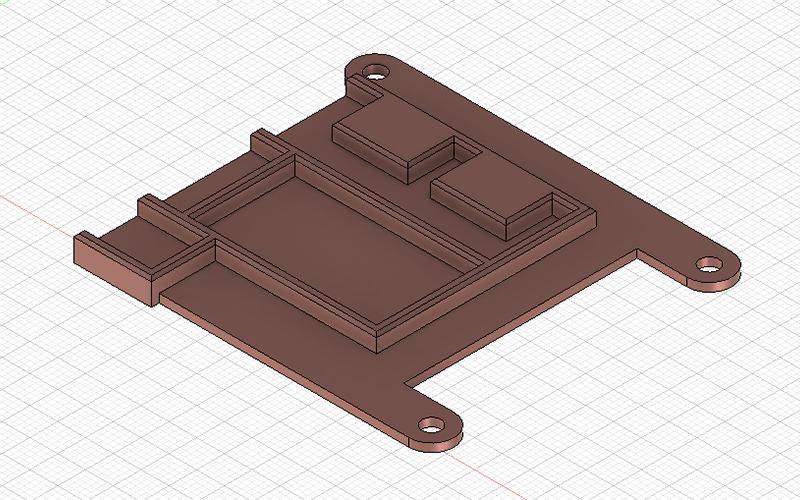
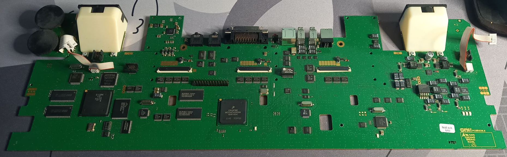
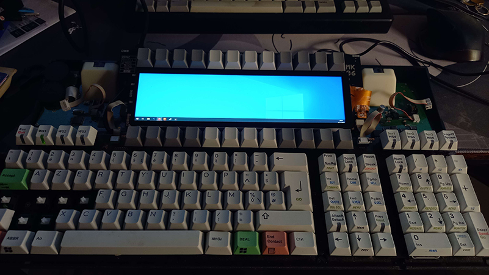
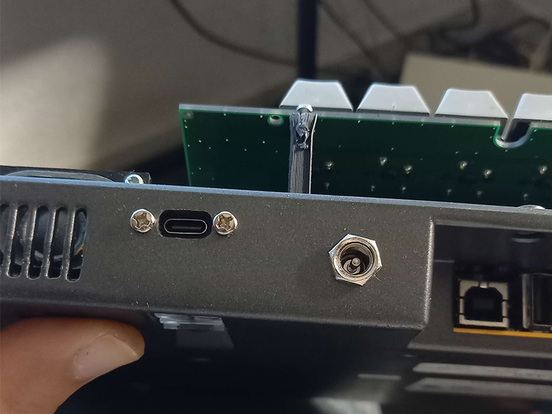
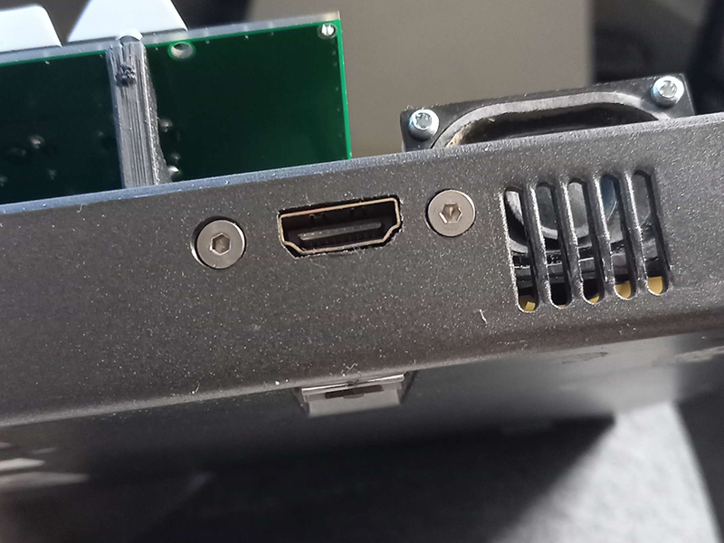

# Weytec MK06 w/ HDMI wide LCD
## [*Cyberboard but not stupid*](https://www.reddit.com/r/MechanicalKeyboards/comments/17qkznx/cyberboard_but_not_stupid/)

### Introduction

The [Weytec MK06](https://deskthority.net/wiki/Weytec_Mk06) is a keyboard designed and sold by Wey Technologies and manufactured by GMK. It's a trading keyboard that has been declared as EOL (12/31/2020) by WEY Technologies.

Those keyboards have a proprietary protocol and connector and needed a controller box to plug them into a computer. The list price was around 2600$... Very specialized.

For more hardware information and operation manual, take a look at [dilucide's github](https://github.com/dilucide/WeyMK06).

### Scope of this repo

This github repository will not talk about how to convert your Weytec into a usable keyboard via a converter. For that, you can have a look at [my other repo](https://github.com/melka/vial-qmk/tree/mk06/keyboards/converter/wey_mk06/atmega32u4) with atmega32u4 port of [MMcM's amazing work](https://deskthority.net/viewtopic.php?f=7&t=27319) and vial compatibility.

This is just an infodump on how I replaced the internal LCDs with an aftermarket panel.

The keyboard being closed and assembled, I don't feel like reopening it to take more pictures, but everything is pretty easy and self explanatory.

## BOM

Obviously you'll need a Weytec MK06. Those come and go on eBay, I was lucky enough to get mine for around 1OO€ a while ago.

The keyboards needs a 12V power supply. I used a cheap wall wart rated at 2A I had laying around and I bought some [panel mount DC power jacks](https://fr.aliexpress.com/item/1005002013180738.html).

[The screen I used](https://fr.aliexpress.com/item/1005002013180738.html) came with a touch panel and in a small aluminium enclosure. Up to you if you want to order the touch version, but you need to free it from it's box. There are other listings for the same kind of screen on AliExpress, but be sure that the dimensions are the same and that the controller board fits. You might have to redesign the LCD controller holder part for a different board.

I got myself [an HDMI female to Micro HDMI male panel mount cable](https://fr.aliexpress.com/item/1005004884692970.html) to have a fullsize HDMI port on the back.

For the internal conversion, I used a [standard Pro Micro clone](https://fr.aliexpress.com/item/32888212119.html) with a [cheap RS232 module](https://fr.aliexpress.com/item/1005004893579002.html?gatewayAdapt=glo2fra). More infos on that on [the other repo]https://github.com/melka/vial-qmk/tree/mk06/keyboards/converter/wey_mk06/atmega32u4.

Since I didn't want to have 2 USB cables - one for the Pro Micro, one for the LCD controller - I cut open and removed the ports on [this USB hub](https://fr.aliexpress.com/item/1005005865800439.html). I also desoldered the USB port on the Pro Micro (easier if you use a micro USB one instead of a USB-C) and wired them directly to the HUB. I also cut a micro USB cable - keeping the micro port to plug into the LCD controller - and wired it directly to the second port of the hub.

Finally, I wired [this panel mount USB-C cable](https://fr.aliexpress.com/item/1005005292322724.html) to the upstream port of the hub.

All in all, it came out at around 200€ including the keyboard. Your price will vary depending on the deals you find.

## 3D Printed Parts

In the *3D printed parts* folder, you'll find the Fusion 360 projects and the exported STLs that I use to hold everything together. Parts were printed on an Ender 3 with PLA @ 0.2mm / 80% infill.

The PCB holding the original screen is held on plastic brackets. I redesigned them to leave more room for the various cables. You need to print at least 2 of them, I don't find the middle one very useful and it complexifies assembly.

The LCD sled is used to attach your new LCD to the PCB and compensating for the space between the panel and the top case.

The LCD controller holder goes under the angled PCB. It's used to attach the board that came with your display. You'll need 3 or 4 M2.5 screws.

This part is designed around my build, you most certainly need to redesign it according to your choice of internal electronics. The top recess is for the USB hub naked PCB, middle is for the promicro, and bottom recess is for the RS232 module. The electronics are just friction fit in the recesses.

You also need to print 5 washers to compensate for the screw length. You need them on the holes that are not covered by holders. If you don't use the washers, you risk having the screw poking at your LCD panel.

## Assembly

After making sure that the weytec firmware is configured as you like, you can remove the original LCDs and unscrew them from the angled PCB. Keep the screws, you'll use them to attache the LCD sled.

You should also remove the original PCB brackets and replace them by the ones you printed. You can also keep the same screws.

Now is also a good time to remove the protective metal shim and acrylic cover on the top case. The acrylic is glued to the top case on some thin skinny plastic features. Be careful when removing it to not overbend or break the top case.

Once unglued, it's a good time to remove the leftover adhesive using IPA and / or a scraper. That adhesive will leave traces on the new panel and makes assembly a bit harder.

You can now install the LCD sled and holders using the screws you removed before.

Do a dry fit test by reassembling everything and just putting the LCD in the sled. You want the panel to just fit below the top case screen hole and not force on the plastic. Adjust the sled by reprinting it taller or smaller as needed.

Once you're happy with the fit, you can glue the LCD into the sled. Be sure that it's well centered (adjust visually and by measuring with the F-Key rows) before comitting. I used regular cyanoacrylate for that.

You can now wire all your electronics on that monstrous piggybacked assembly.

## Case modification

I printed some cutting templates in order to better align the HDMI and USBC ports. I just attached a bit of painters tape to the exterior of the bottom case, traced the outlines from the templates, and then went at it with a dremel and some files. Hope you'll do a better job than me.

I also drilled an 8mm hole for the power jack.

Once the holes are cut, you can screw in your cables and close up the keyboard.

## Possible upgrades

The LCD controller I got has a couple buttons and a header for adjusting the LCD brightness. Those could be wired to the arduino and custom code in QMK could be used to adjust the screen.

The wiring job was kind of a pain, it might be easier to design a small conversion PCB with integrated hub controller etc... instead of rewiring all that stuff with enamel wire.

## License

This work is under CERN-OHL-S v2 license. Please just be kind and don't go around asking thousands to make this silly project, and drop me a line to say thanks if it helps you.
